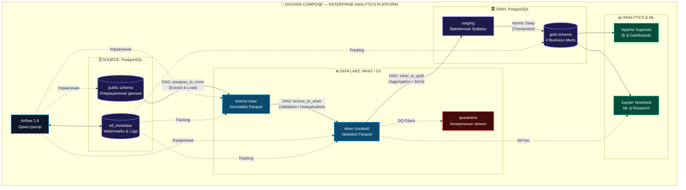
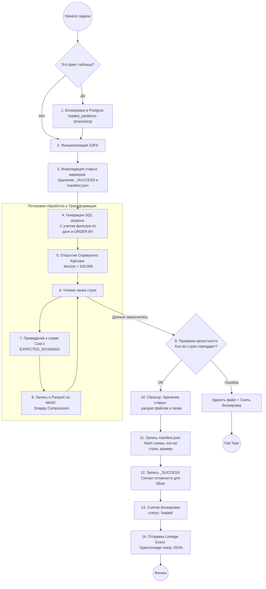
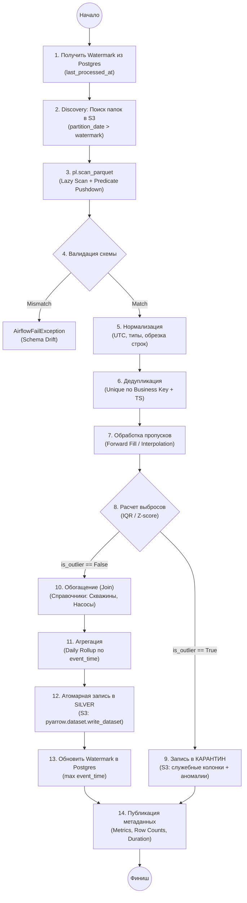
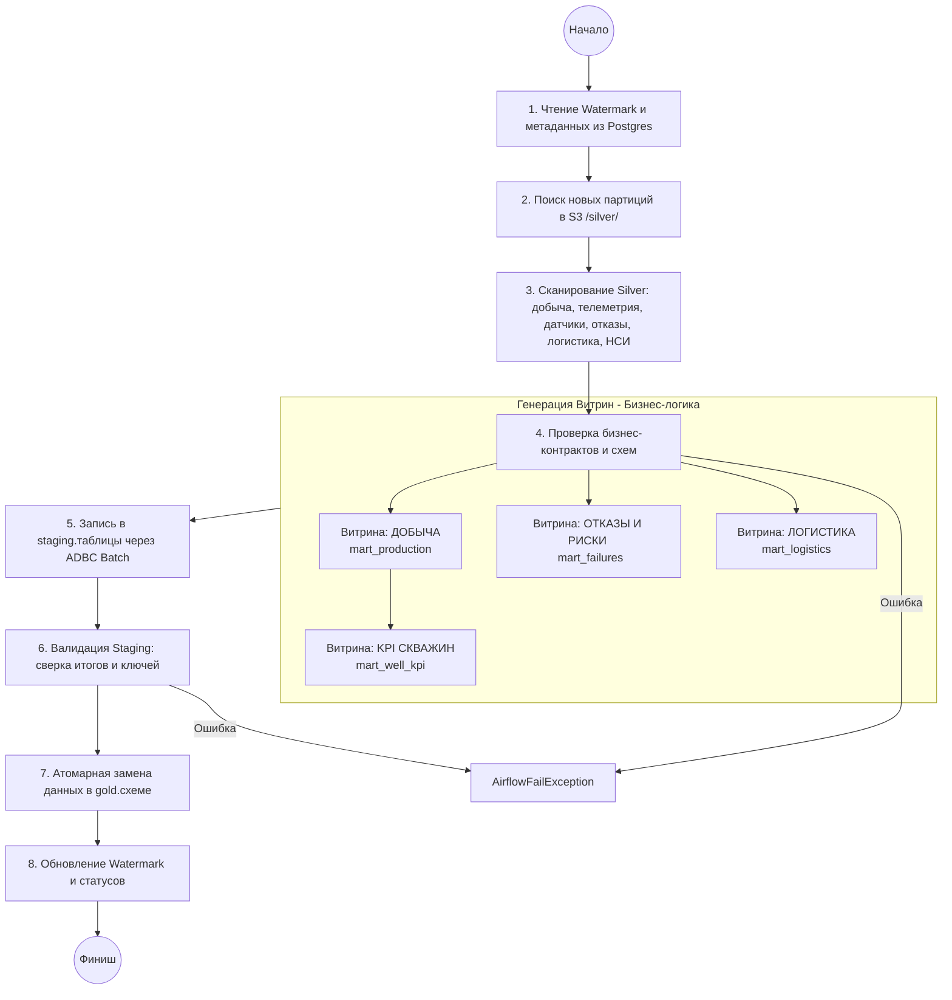
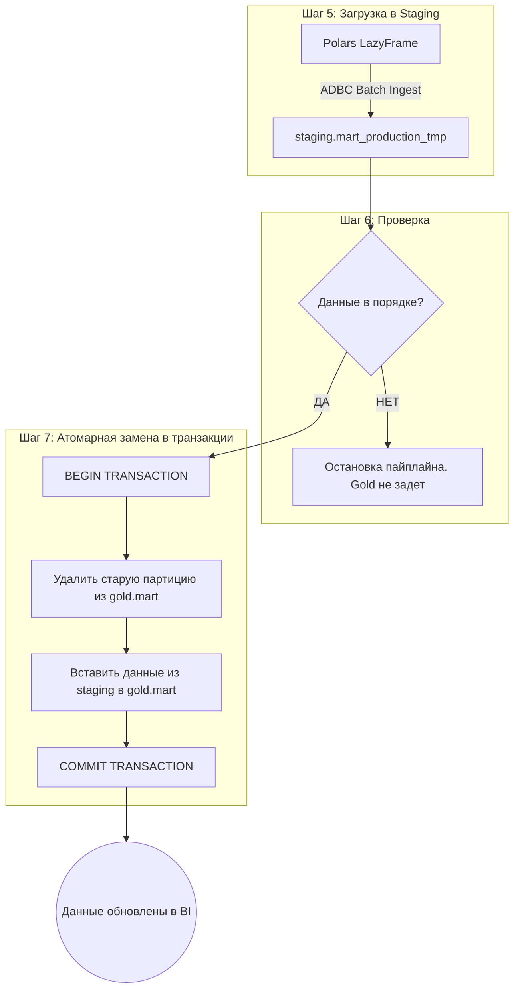

# Oil & Gas Analytics Platform

Платформа аналитики нефтедобычи на базе **Medallion Architecture**.

---

## 1. Архитектура

### Общая архитектура (Medallion)



---

# 2. Технологический стек (Technical Stack)

Платформа построена на современном стеке с акцентом на высокую производительность (**Polars**), инкрементальную обработку и соблюдение методологии **Medallion Architecture**.

### 2.1. Основные компоненты

| Слой / Область | Технология | Версия | Роль в проекте |
| :--- | :--- | :--- | :--- |
| **Orchestration** |  | `2.8.1` | Оркестрация DAG, управление зависимостями и ретраями. |
| **Data Lake (S3)** |  | `Latest` | Хранение слоев Bronze (Raw) и Silver (Curated) в формате Parquet. |
| **Data Processing** |   | — | Быстрая обработка через Lazy Execution. Оптимизация памяти. |
| **Database (DWH)** |  | `15.0` | Serving-слой (Gold), хранение метаданных и операционных данных. |
| **BI & Analytics** |  | `3.1.0` | Визуализация бизнес-метрик, построение дашбордов и SQL Lab. |
| **ML & Research** |  | — | Прототипирование моделей и ad-hoc анализ данных Silver-слоя. |

### 2.2. Окружение и разработка

*   **Язык программирования:**  `3.11` (строгая типизация, dataclasses).
*   **Инфраструктура:**  Docker Compose (контейнеризация всех сервисов).
*   **Метаданные:** PostgreSQL (схема `etl_metadata`), управление состояниями через **Watermarks**.
*   **Формат данных:**  — основной формат хранения для обеспечения сжатия и высокой скорости чтения (Columnar Storage).

---

### Почему выбран этот стек:
1.  **Polars вместо Pandas:** Обеспечивает многократное преимущество в скорости и параллельной обработке телеметрии без полной загрузки данных в RAM.
2.  **Medallion на S3:** Разделение Bronze/Silver на MinIO позволяет бесконечно масштабировать хранилище независимо от вычислительных мощностей.
3.  **Atomic Swap в Postgres:** Использование PostgreSQL для Gold-слоя гарантирует ACID-совместимость и мгновенный отклик дашбордов Superset.
4.  **Airflow 2.8:** Использование современных декораторов `@task` упрощает код и делает логику пайплайнов более прозрачной.

Дополнительно:

* s3fs + pyarrow для работы с MinIO
* adbc-driver-postgresql для быстрой загрузки в Gold

---

# 3. Бизнес-логика и аналитические цели

Платформа спроектирована как инструмент поддержки принятия решений (DSS) и охватывает четыре ключевых бизнес-домена. Бизнес-логика реализуется на уровнях Silver (очистка) и Gold (агрегация).

### 3.1. Домен: Аналитика добычи (Production Excellence)
**Цель:** Максимизация операционной эффективности скважинного фонда.
*   **Бизнес-индикаторы (KPI):** 
    *   *Среднесуточный дебит:* расчет фактического объема добычи в тоннах.
    *   *Коэффициент эксплуатации (Uptime):* отношение времени работы к общему времени (выявление % простоя).
*   **Логика анализа:** Сравнение скважин-лидеров и аутсайдеров для тиражирования лучших практик. Установление корреляции между физическими параметрами (пластовое давление, температура) и объемом добычи.

### 3.2. Домен: Прогнозное моделирование (ML Yield Forecasting)
**Цель:** Переход от реактивного планирования к проактивному.
*   **ML-логика:** Использование исторической телеметрии (давление, мощность насосов, температура) для предсказания дебита на следующие сутки.
*   **Бизнес-ценность:** Позволяет финансовому департаменту точнее прогнозировать выручку, а производственному — планировать нагрузку на систему сбора нефти.

### 3.3. Домен: Надежность и Предиктивное обслуживание (Reliability & Maintenance)
**Цель:** Снижение затрат на ремонт и минимизация внеплановых остановок.
*   **Логика выявления аномалий:** Применение статистических методов (Z-score) и алгоритмов Isolation Forest к потокам данных вибрации и тока для обнаружения «предвестников» поломки.
*   **Risk Scoring:** Назначение каждой единице оборудования индекса риска (от 0 до 1). При превышении порога система сигнализирует о необходимости техобслуживания.

### 3.4. Домен: Логистическая оптимизация (Supply Chain Optimization)
**Цель:** Снижение удельной стоимости транспортировки единицы продукции.
*   **Бизнес-метрики:** 
    *   *Cost per km/ton:* мониторинг эффективности затрат на логистику.
    *   *Driver Performance Index:* оценка качества работы водителей на основе соблюдения графиков.
*   **Анализ факторов:** Оценка влияния внешних условий (погода, дорожная ситуация) на задержки поставок для оптимизации маршрутной сети.

---

# 4. Архитектура Базы Данных DWH(company_data) || datalike(row)

```text

company_data
├── SCHEMA: public                  ← Операционные исходные данные
│   ├── wells
│   ├── production
│   ├── well_telemetry
│   ├── well_targets
│   ├── pumps
│   ├── pump_sensors
│   ├── pump_failures
│   ├── deliveries
│   ├── drivers
│   ├── vehicles
│   └── oil_stations
│
├── SCHEMA: etl_metadata            ← Метаданные и управление
│   ├── loaded_partitions
│   ├── pipeline_watermarks
│   ├── dq_validation_results
│   ├── dq_quarantine_registry
│   └── marts_loaded_partitions
│
├── SCHEMA: staging                 ← Временные таблицы (atomic load)
│   ├── stg_mart_production
│   ├── stg_mart_well_kpi
│   ├── stg_mart_failures
│   └── stg_mart_logistics
│
└── SCHEMA: gold                    ← Аналитические витрины
    ├── mart_production
    ├── mart_well_kpi
    ├── mart_failures
    └── mart_logistics


```

Структура Data Lake (MinIO)

```text

s3://datalake/
├── raw/           ← Bronze (неизменяемые данные из Postgres)
├── silver/        ← Silver (очищенные, нормализованные, дедуплицированные)
├── quarantine/    ← Quarantine (проблемные записи)

```

---

# 5. DAG (Airflow)

# Архитектура загрузки данных в datalike



# Архитектура транспозиции данных с datalike -> silver layer




# Архитектура транспозиции данных с silver layer -> gold layer




---

## 6. Руководство по развертыванию и запуску

Платформа полностью контейнеризирована и разворачивается с помощью **Docker Compose**.

### 6.1. Системные требования
*   **ОС:** Linux (рекомендуется) или macOS/Windows с установленным Docker Desktop.
*   **Ресурсы:** Минимум 8 ГБ ОЗУ (рекомендуется 16 ГБ), 4 ядра ЦП.
*   **Инструменты:** Docker 20.10+, Docker Compose 2.0+.

### 6.2. Шаг 1: Подготовка окружения
Клонируйте репозиторий и создайте необходимые директории для хранения данных:

```bash
git clone https://github.com/your-repo/oil-analytics-platform.git
cd oil-analytics-platform
mkdir -p ./dags ./logs ./plugins ./data/minio
```

### 6.3. Шаг 2: Запуск инфраструктуры
Запустите все сервисы в фоновом режиме. Docker Compose автоматически поднимет PostgreSQL, MinIO, Airflow, Superset и Jupyter.

```bash
docker-compose up -d --build
```

### 6.4. Шаг 3: Инициализация баз данных и схем
После запуска PostgreSQL необходимо создать структуру таблиц. Скрипты инициализации (`/scripts/init_db.sql`) обычно выполняются автоматически при старте контейнера, но при необходимости их можно запустить вручную:

```bash
# Вход в контейнер Postgres и создание схем
docker exec -it postgres psql -U admin -d company_data -f /docker-entrypoint-initdb.d/init_db.sql
```

### 6.5. Шаг 4: Настройка подключений в Airflow
Зайдите в UI Airflow (`http://localhost:8080`, логин/пароль по умолчанию: `airflow/airflow`). Подключение обычно устанавливаються автоматически, но при необходимости можно добавить следующие подключения (Connections):

1.  **postgres_default:** Тип `Postgres`, хост `postgres`, порт `5432`, БД `company_data`.
2.  **aws_default (для MinIO):**
    *   Conn Type: `Amazon S3`
    *   Extra: `{"endpoint_url": "http://minio:9000", "aws_access_key_id": "admin", "aws_secret_access_key": "password"}`

### 6.6. Шаг 5: Запуск пайплайнов
В интерфейсе Airflow включите (Unpause) и запустите DAG-и в следующей последовательности:
1.  `postgres_to_minio_enterprise_2` — загрузка из источника в Bronze слой.
2.  `bronze_to_silver_pipeline` — обработка, очистка и загрузка в Silver слой.
3.  `silver_to_gold_marts` — агрегация и публикация финальных витрин в Gold слой.

### 6.7. Шаг 6: Доступ к результатам

| Сервис | URL | Назначение |
| :--- | :--- | :--- |
| **Airflow** | `http://localhost:8080` | Мониторинг и управление пайплайнами. |
| **MinIO** | `http://localhost:9001` | Просмотр файлов в слоях Bronze, Silver, Quarantine. |
| **Superset** | `http://localhost:8088` | Визуализация дашбордов и анализ витрин. |
| **Jupyter** | `http://localhost:8888` | Исследование данных (EDA) и запуск ML-моделей. |


