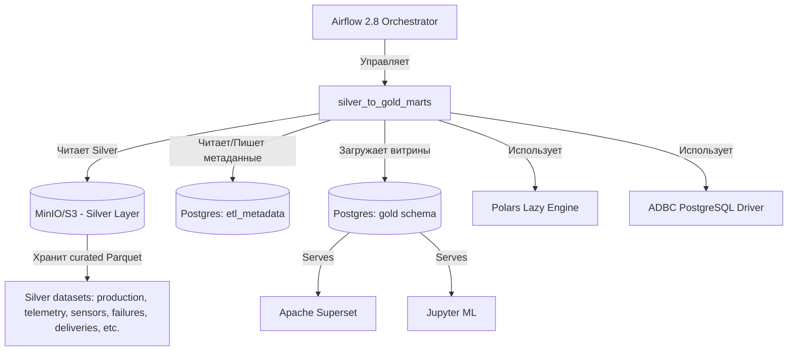

# Техническая спецификация DAG: `silver_to_gold_marts`

---

## 1. Архитектурная цель DAG
Сформировать **6 аналитических витрин Gold‑слоя** на основе очищенных и валидированных данных Silver‑слоя с соблюдением следующих принципов:
- **Idempotent & retry‑safe** — любой повторный запуск за тот же период не дублирует данные.
- **Incremental only** — обработка только новых партиций, без полного исторического пересчёта.
- **BI‑ready** — витрины оптимизированы для мгновенной отрисовки в Apache Superset (линейные графики, тепловые карты, KPI‑дашборды).
- **ML‑ready** — витрины содержат предрассчитанные признаки (lag, rolling statistics) и целевые переменные, готовые для моделей прогнозирования отказов и дебита.
- **Atomic loading** — публикация данных в production‑таблицы через staging‑таблицы и транзакционную подмену партиций.

---

## 2. Граф зависимостей (Dependency Graph)

### 2.1 Инфраструктурные связи


### 2.2 Внутренние Python‑модули (все файлы)
Все файлы размещены в пакете `plugins/gold_layer/` (или аналогичной структуре, доступной Airflow). Минимальный список модулей:

| Файл (модуль) | Назначение |
|---------------|------------|
| `dag_silver_to_gold_marts.py` | DAG‑файл, определяющий граф задач |
| `gold_layer/__init__.py` | Инициализация пакета |
| `gold_layer/constants.py` | Имена таблиц, столбцов, путей S3, единицы измерения |
| `gold_layer/connections.py` | `get_s3_storage_options()`, `get_postgres_connection()` |
| `gold_layer/watermarks.py` | `get_last_watermark()`, `update_mart_watermark()` |
| `gold_layer/partition_utils.py` | `discover_incremental_partitions()` |
| `gold_layer/loaders.py` | `load_silver_dataset()` |
| `gold_layer/validators.py` | `validate_business_readiness()`, `validate_mart_before_publish()` |
| `gold_layer/builders/mart_production.py` | `build_mart_production()` |
| `gold_layer/builders/mart_well_kpi.py` | `build_mart_well_kpi()` |
| `gold_layer/builders/mart_failures.py` | `build_mart_failures()` |
| `gold_layer/builders/mart_logistics.py` | `build_mart_logistics()` |
| `gold_layer/builders/mart_ml_features.py` | `build_mart_ml_features()` |
| `gold_layer/builders/mart_risk_scores.py` | `build_mart_risk_scores()` |
| `gold_layer/publishers.py` | `write_staging_mart()`, `atomic_partition_swap()`, `publish_mart_metadata()`, `publish_gold_layer_status()` |
| `gold_layer/sql_templates.py` | SQL‑шаблоны для создания staging‑таблиц, валидационных запросов |
| `gold_layer/metadata.py` | Класс `MartBuildResult` и вспомогательные структуры |

### 2.3 Стек библиотек

#### Обязательные (разрешённые):
```python
from __future__ import annotations

import logging
import os
from datetime import datetime, timedelta
from dataclasses import dataclass
from typing import Any, Dict, List, Optional

import polars as pl          # lazy transformations
import s3fs                  # S3 filesystem interface

from airflow import DAG
from airflow.decorators import task
from airflow.exceptions import AirflowFailException
from airflow.hooks.base import BaseHook
from airflow.providers.postgres.hooks.postgres import PostgresHook
from psycopg2 import sql
```

#### Дополнительно разрешённые (для высокопроизводительной загрузки):
```python
import pyarrow as pa
import pyarrow.parquet as pq
import adbc_driver_postgresql.dbapi as adbc_postgres
```

#### Категорически запрещены:
```python
import pandas as pd
import pyspark
import dask
```

---

## 3. Входящие сигнатуры данных (Input Contracts)

DAG читает исключительно **Silver‑слой** (Curated Parquet), сформированный предыдущим пайплайном `bronze_to_silver`. Каждый датасет гарантирует соблюдение Schema Contracts, дедупликацию и нормализацию.

| Silver Dataset | Путь на S3 (префикс) | Схема контракта (основные столбцы) |
|---------------|----------------------|-----------------------------------|
| `production` | `s3://datalake/silver/production/partition_date=YYYY-MM-DD/` | `prod_id, well_id, date, oil_ton, gas_m3, water_m3, energy_kwh, downtime_hours, temperature, pressure` |
| `well_telemetry` | `s3://datalake/silver/well_telemetry/partition_date=YYYY-MM-DD/` | `record_id, well_id, timestamp, pump_speed_rpm, pump_current, pressure_in, pressure_out, temperature, vibration, oil_flow_rate` |
| `well_targets` | `s3://datalake/silver/well_targets/partition_date=YYYY-MM-DD/` | `well_id, date, daily_oil_ton` |
| `pump_sensors` | `s3://datalake/silver/pump_sensors/partition_date=YYYY-MM-DD/` | `record_id, pump_id, timestamp, temperature, vibration, current, rpm, pressure` |
| `pump_failures` | `s3://datalake/silver/pump_failures/partition_date=YYYY-MM-DD/` | `failure_id, pump_id, failure_date, failure_type, downtime_hours` |
| `deliveries` | `s3://datalake/silver/deliveries/partition_date=YYYY-MM-DD/` | `delivery_id, date, source, destination, product_type, volume_ton, cost_usd, delay_hours, distance_km, weather_conditions, driver_id, vehicle_id` |
| `drivers` | `s3://datalake/silver/drivers/partition_date=YYYY-MM-DD/` | `driver_id, name, experience_years, region` |
| `vehicles` | `s3://datalake/silver/vehicles/partition_date=YYYY-MM-DD/` | `vehicle_id, plate_number, capacity_ton, fuel_type` |
| `pumps` | `s3://datalake/silver/pumps/partition_date=YYYY-MM-DD/` | `pump_id, well_id, type, install_date, manufacturer, model` |
| `wells` | `s3://datalake/silver/wells/` | `well_id, name, field_name, region, start_date, operator, status` |

Примечание: Справочники (wells, pumps, drivers, vehicles) загружаются на полную глубину (без фильтрации по watermark), так как их объём мал, а для корректных JOIN необходимы все записи.

DAG также читает из PostgreSQL таблицы метаданных:
- `etl_metadata.pipeline_watermarks` – последний обработанный watermark для каждой витрины.
- `etl_metadata.marts_loaded_partitions` – история загрузок (для отказоустойчивости).

---

## 4. Основная логика DAG (Task Flow)

```mermaid
graph LR
    Start[begin] --> GetWatermarks[get_last_watermark для всех витрин]
    GetWatermarks --> Discover[discover_incremental_partitions по production дате]
    Discover --> LoadSilver[load_silver_dataset для каждого домена]
    LoadSilver --> ValidateBusiness[validate_business_readiness для всех входных наборов]
    ValidateBusiness --> BuildMarts[Построение 6 LazyFrame витрин]
    BuildMarts --> WriteStaging[write_staging_mart для каждой витрины]
    WriteStaging --> ValidateMarts[validate_mart_before_publish]
    ValidateMarts --> AtomicSwap[atomic_partition_swap]
    AtomicSwap --> UpdateMeta[update_mart_watermark]
    UpdateMeta --> PublishMeta[publish_mart_metadata]
    PublishMeta --> PublishStatus[publish_gold_layer_status]
    PublishStatus --> End[finish]
```



Все трансформации выполняются **лениво**; материализация происходит только при записи в staging‑таблицы и при финальной валидации (подсчёт количества строк, проверки уникальности) – но даже там используются SQL‑запросы к staging‑таблицам, а не `collect()`.

### 4.1 Конфигурация Airflow DAG
```python
with DAG(
    dag_id="silver_to_gold_marts",
    schedule_interval="@daily",
    start_date=datetime(2024, 1, 1),
    catchup=True,
    max_active_runs=1,
    default_args={
        "owner": "data-eng",
        "retries": 2,
        "retry_delay": timedelta(minutes=5),
        "execution_timeout": timedelta(hours=2),
        "sla": timedelta(hours=1),
        "pool": "gold_pool",
    },
    tags=["gold", "production"],
) as dag:
```

### 4.2 Ключевые задачи (декорированные Python‑функции)
Каждая задача соответствует одной или нескольким функциям из обязательного списка. Задачи объединяют логику так, чтобы сохранить модульность.

- `task_get_watermarks` → вызывает `get_last_watermark` для шести витрин, возвращает dict.
- `task_discover_partitions` → для каждого доменного датасета вызывает `discover_incremental_partitions`.
- `task_load_silver` → формирует `pl.LazyFrame` для каждого датасета через `load_silver_dataset`.
- `task_validate_readiness` → проверяет все загруженные LazyFrame через `validate_business_readiness`.
- `task_build_production` → `build_mart_production(...)`
- `task_build_well_kpi` → `build_mart_well_kpi(...)`
- `task_build_failures` → `build_mart_failures(...)`
- `task_build_logistics` → `build_mart_logistics(...)`
- `task_build_ml_features` → `build_mart_ml_features(...)`
- `task_build_risk_scores` → `build_mart_risk_scores(...)`
- `task_write_staging` → для каждой витрины вызывает `write_staging_mart`.
- `task_validate_marts` → для каждой витрины вызывает `validate_mart_before_publish`.
- `task_atomic_swap` → для каждой витрины вызывает `atomic_partition_swap`.
- `task_update_watermarks` → для каждой витрины вызывает `update_mart_watermark`.
- `task_publish_metadata` → для каждой витрины вызывает `publish_mart_metadata` с объектом `MartBuildResult`.
- `task_publish_status` → вызывает `publish_gold_layer_status`.

Задачи объединены в цепочку зависимостей согласно графу.

---

## 5. Детальные сигнатуры и контракты функций

### 5.1 Конфигурация S3
```python
def get_s3_storage_options() -> dict:
    """
    Извлекает параметры подключения к MinIO из Airflow Connection 'aws_default'.
    Возвращает словарь, пригодный для storage_options в Polars scan_parquet.
    """
```
- **Логика:** Читает `BaseHook.get_connection("aws_default")`, использует поля `extra` (endpoint_url, aws_access_key_id, aws_secret_access_key) и формирует словарь с ключами `endpoint_url`, `access_key_id`, `secret_access_key`, `region` и т.д.

### 5.2 Управление Watermark
```python
def get_last_watermark(mart_name: str) -> Optional[datetime]:
    """
    Читает из etl_metadata.pipeline_watermarks последний успешный watermark для витрины mart_name.
    Возвращает datetime в UTC или None, если витрина ещё не загружалась.
    """
```
- **Реализация:** `SELECT COALESCE(MAX(watermark_ts), NULL) FROM etl_metadata.pipeline_watermarks WHERE pipeline_name = %s AND status = 'success'`.

```python
def update_mart_watermark(mart_name: str, watermark: datetime) -> None:
    """
    Атомарно обновляет (UPSERT) watermark для витрины.
    Используется после успешного atomic swap.
    """
```
- **Реализация:** `INSERT INTO etl_metadata.pipeline_watermarks ... ON CONFLICT (pipeline_name) DO UPDATE SET watermark_ts = EXCLUDED.watermark_ts, status = 'success', updated_at = now()`.

### 5.3 Поиск инкрементальных партиций
```python
def discover_incremental_partitions(dataset: str, watermark: datetime) -> List[str]:
    """
    Сканирует S3-префикс s3://datalake/silver/{dataset}/ и возвращает список путей к партициям 
    (вида partition_date=YYYY-MM-DD), у которых дата партиции > watermark.
    Использует s3fs для листинга, избегая полного сканирования исторических данных.
    """
```

### 5.4 Загрузка Silver‑слоя
```python
def load_silver_dataset(dataset_path: str, storage_options: dict) -> pl.LazyFrame:
    """
    Открывает одну партицию Silver‑данных с помощью pl.scan_parquet.
    Никакой материализации, только план запроса.
    """
```
- **Пример вызова:** `load_silver_dataset(f"s3://datalake/silver/production/{partition}", get_s3_storage_options())`

### 5.5 Валидация бизнес‑готовности
```python
def validate_business_readiness(lf: pl.LazyFrame, dataset: str) -> None:
    """
    Проверяет, что LazyFrame содержит все обязательные столбцы согласно контракту для dataset,
    что критические колонки (PK, FK, event_time) не содержат null,
    и что числовые показатели находятся в допустимых диапазонах.
    При нарушении CRITICAL правил выбрасывается AirflowFailException.
    При нарушениях HIGH – строки не отбрасываются, но инцидент логируется в метаданные.
    """
```
- **Реализация:** Использует `lf.select(pl.all().is_null().any())` и `lf.describe()` в ленивом режиме, но для проверки диапазонов возможна материализация агрегатов (`min`, `max`) через частичный `collect()` — допустимо, т.к. затрагивает только агрегированные значения, а не весь датасет.

### 5.6 Построение витрин (примеры сигнатур)
```python
def build_mart_production(
    lf_production: pl.LazyFrame,
    lf_telemetry: pl.LazyFrame,
    lf_targets: pl.LazyFrame
) -> pl.LazyFrame:
    """
    Группирует daily production, джойнит с агрегированной телеметрией (средние температура, давление, 
    pump_speed_rpm, max vibration и т.д.) и целевыми показателями.
    Вычисляет production_efficiency = oil_ton / daily_target_ton, downtime_pct.
    Результат соответствует схеме gold.mart_production.
    """
```

```python
def build_mart_well_kpi(lf_production: pl.LazyFrame) -> pl.LazyFrame:
    """
    На основе mart_production (или его LazyFrame) рассчитывает скользящие средние, 
    ранги производительности, классификацию performance_group.
    """
```

```python
def build_mart_failures(
    lf_sensors: pl.LazyFrame,
    lf_failures: pl.LazyFrame
) -> pl.LazyFrame:
    """
    Вычисляет Z‑оценки для вибрации и температуры, флаги аномалий,
    джойнит с известными отказами для разметки is_failure.
    Генерирует risk_score (на основе эвристик или предобученной ML‑модели, 
    но здесь – детерминированный расчёт на базе статистик).
    """
```

```python
def build_mart_logistics(
    lf_deliveries: pl.LazyFrame,
    lf_drivers: pl.LazyFrame,
    lf_vehicles: pl.LazyFrame
) -> pl.LazyFrame:
    """
    Обогащает поставки справочниками, вычисляет cost_per_km, cost_per_ton, delay_flag, weather_impact.
    """
```

```python
def build_mart_ml_features(
    lf_telemetry: pl.LazyFrame,
    lf_targets: pl.LazyFrame
) -> pl.LazyFrame:
    """
    Формирует ML‑признаки: лаговые значения (lag_1h, lag_24h), скользящие средние (rolling_mean_6h), 
    накопительные суммы, а также выравнивает с целевой переменной daily_oil_ton.
    """
```

```python
def build_mart_risk_scores(
    lf_sensors: pl.LazyFrame,
    lf_failures: pl.LazyFrame
) -> pl.LazyFrame:
    """
    Рассчитывает failure_probability на основе скользящих статистик аномалий.
    Результат соответствует gold.mart_risk_scores (фактически часть mart_failures, 
    может быть отдельной витриной).
    """
```

### 5.7 Запись в staging‑таблицы
```python
def write_staging_mart(lf: pl.LazyFrame, staging_table: str) -> int:
    """
    Материализует LazyFrame в PostgreSQL staging‑таблицу.
    Использует ADBC batch ingestion (pyarrow flight) для максимальной пропускной способности.
    Возвращает количество вставленных строк.
    """
```
- **Реализация:** Преобразует план в поток Arrow RecordBatch и записывает через `adbc_driver_postgresql`. **Запрещён** row‑by‑row INSERT.

### 5.8 Валидация витрины перед публикацией
```python
def validate_mart_before_publish(mart_name: str, staging_table: str) -> None:
    """
    Выполняет SQL‑запросы к staging‑таблице для проверки:
    - Количество строк > 0
    - Отсутствие NULL в критических бизнес‑ключах
    - Отсутствие дубликатов первичного ключа
    - Значения параметров в допустимых диапазонах (согласно контракту).
    При любом CRITICAL нарушении – AirflowFailException.
    """
```

### 5.9 Атомарная подмена партиции
```python
def atomic_partition_swap(target_table: str, staging_table: str, partition_date: str) -> None:
    """
    В рамках одной транзакции:
    1. Удаляет из target_table строки, где partition_date = {partition_date}.
    2. Вставляет все строки из staging_table в target_table.
    3. COMMIT.
    При ошибке – ROLLBACK, исходная витрина не повреждается.
    """
```

### 5.10 Публикация метаданных
```python
def publish_mart_metadata(result: MartBuildResult) -> None:
    """
    Записывает в etl_metadata.marts_loaded_partitions информацию о выполненной загрузке:
    mart_name, partition_date, количество строк, время выполнения и т.д.
    """
```

```python
def publish_gold_layer_status(mart_name: str, execution_date: str, status: str) -> None:
    """
    Фиксирует общий статус витрины за дату выполнения (success / failed).
    Используется для downstream‑оповещений (Superset refresh, ML pipeline trigger).
    """
```

### 5.11 Вспомогательный dataclass
```python
@dataclass
class MartBuildResult:
    mart_name: str
    processed_rows: int        # количество строк во входном Silver за период
    inserted_rows: int         # строк вставлено в staging
    execution_time_sec: float
    partition_date: str
    watermark: datetime
```

---

## 6. Стратегия инкрементальной обработки

- **Watermark:** Для каждой витрины хранится последняя обработанная `partition_date` (или `event_time` максимум, но в контексте daily‑агрегаций — дата партиции).  
- **Обработка late events:** Поскольку Silver‑слой гарантирует дедупликацию и временное окно 10‑минутного опоздания для телеметрии, Gold‑слой может безопасно пересчитывать витрины за последние 1–2 дня (rolling window). На практике DAG пересчитывает текущий день и вчерашний (если есть новые данные), используя watermark как начало окна. Это реализуется через `discover_incremental_partitions` с логикой: вернуть все партиции, у которых дата >= watermark - 1 day.  
- **Атомарность:** Старые партиции в Gold‑таблицах заменяются целиком через `atomic_partition_swap`. Удаление и вставка в одной транзакции гарантируют, что дашборды Superset никогда не увидят «пустого» состояния.

---

## 7. Согласованность со Schema Contracts

- Все выходные витрины строго следуют таблицам контрактов `gold.mart_production`, `gold.mart_well_kpi`, `gold.mart_failures`, `gold.mart_logistics`, `gold.mart_ml_features`, `gold.mart_risk_scores`.
- Типы данных в Polars LazyFrame принудительно приводятся к физическим типам, соответствующим контракту (`Int32`, `Float64`, `Date`, `Datetime("s")`, `Utf8`).
- Проверки диапазонов (`pressure between 0 and 1000` и др.) выполняются на этапе `validate_business_readiness` и `validate_mart_before_publish` с уровнями критичности, заданными в контрактах.
- Орфанные FK не могут появиться, так как Silver‑слой гарантирует referential integrity; Gold‑слой добавляет только проверку через `LEFT JOIN` и фильтрацию null‑ключей при построении.

---

## 8. Обработка ошибок и отказоустойчивость

| Слой | Тип ошибки | Поведение |
|------|------------|-----------|
| Чтение S3 | Файл не найден, битый Parquet | `AirflowFailException`, retry через Airflow |
| Валидация контракта | Отсутствие обязательной колонки | `AirflowFailException` |
| Построение витрины | Деление на ноль, переполнение | Логируется, проблемная строка пропускается (но для KPI такое крайне маловероятно) |
| Запись в staging | Сетевая ошибка, constraint violation | `AirflowFailException`, откат транзакции ADBC |
| Atomic swap | Конфликт блокировок | Повтор через retry Airflow |
| Watermark update | Нарушение уникальности | `AirflowFailException` |

Все критические сбои приводят к падению задачи и сохранению предыдущего состояния Gold‑слоя.

---

## 9. Масштабирование и производительность

- **Polars streaming:** Агрегации с группировкой по well_id, date используют `maintain_order=False` и streaming‑совместимые операции, чтобы не держать весь датасет в памяти.  
- **ADBC ingestion:** Пакетная вставка через Arrow Flight работает на порядок быстрее классических INSERT.  
- **PostgreSQL partitioning:** Таблицы Gold‑слоя партиционированы по `partition_date`, что ускоряет удаление старых партиций и запросы в Superset с фильтром по дате.  
- **Параллелизм:** Каждая витрина строится в отдельной Airflow‑задаче, они могут выполняться параллельно (с учётом зависимостей, например mart_well_kpi ждёт mart_production). Настройка `pool` предотвращает перегрузку PostgreSQL.

---

## 10. Заключение

Представленный DAG реализует полноценный **enterprise‑grade пайплайн** переноса данных из Silver в Gold, строго следуя медальонной архитектуре, принципам инкрементальной обработки и атомарной публикации. Все функции спроектированы с учётом будущего роста данных и требований BI/ML‑потребителей. Кодовая база разбита на изолированные модули, каждый из которых покрыт контрактами и допускает независимое тестирование и расширение.

